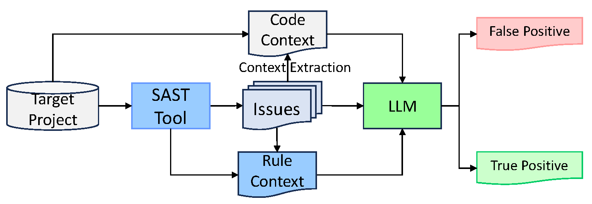

# FP_Shield

This repo is for AILA 2024.

## Introduction




## Structure of the Repository

```bash
.
├── aila2024_rule_info.csv # The rule context of Slither
├── aila2024_rule_info_type.csv # The rule-category mapping for smartbugs-curated
├── final_df.csv # The final result of the validation (Slither)
├── final_df_gpt.csv # The final result of the validation (Slither + FP_Shield)
├── findings_unique.txt # The unique findings of Slither on smartbugs-curated
├── gpt_validation.py # The validation script for FP_Shield (only request GPT API)
├── ground_truth.csv # The ground truth of smartbugs-curated
├── main_validation.py # The main validation script for FP_Shield, entry point
├── process_findings_gpt.py # The post-processing script for FP_Shield, calculate the metrics
├── process_findings.py # The post-processing script for Slither, calculate the metrics
├── README.md
├── Report_Validation.png
├── requirements.txt # The requirements for the project
├── response # The all responses from GPT API on reports from Slither on smartbugs-curated
├── result # The all reports from Slither on smartbugs-curated
├── result_aila2024.csv # The result of the validation (Slither)
├── result_aila2024_gpt.csv # The result of the validation (Slither + FP_Shield)
├── slither # The source code of Slither `git clone https://github.com/crytic/slither.git`
├── smartbugs-curated # The smartbugs-curated dataset `git clone
├── smartbugs-curated.csv # parsed ground truth of smartbugs-curated (Containing line-level ground truth)
├── smartbugs.wiki # The wiki of smartbugs-curated, containing the rule mapping info
└── venv # The virtual environment for the project
```


## Environment Setup

```bash
pip install -r requirements.txt
```

## License

GPL-3.0 License
