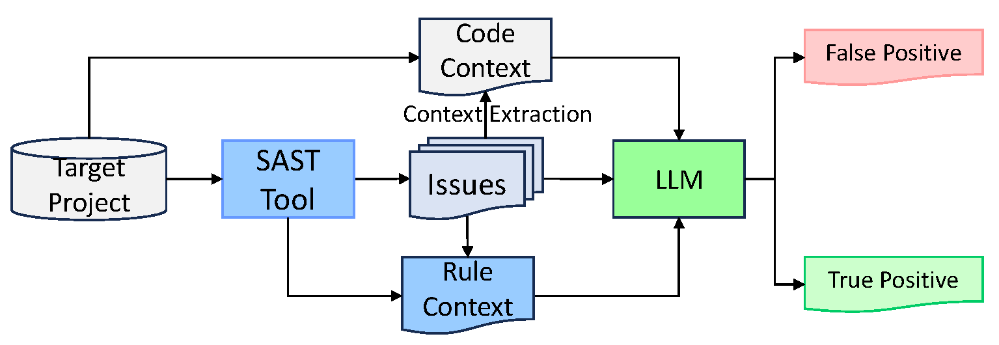

# FP_Shield
Automatic Inspection of Static Application Security Testing (SAST) Reports via Large Language Model Reasoning

## Introduction





Static Application Security Testing (SAST) tools are widely used in practice to identify bugs and vulnerabilities in software programs due to their high coverage and independence from the execution environment. However, existing SAST tools often produce numerous false positives within their reports. Consequently, developers must manually inspect and confirm each issue, a task that is both challenging and time-consuming. Large Language Models (LLMs) have proven to have advanced code semantic understanding capabilities, providing a possibility of effectively acting as human experts in understanding and inspecting the source code and SAST reports.

In this paper, we present a general and easily extensible approach that automatically inspects a large volume of SAST reports using LLM reasoning. Built upon it, we implement a GPT-based prototype named FPShield to automatically shield against potential false positives within SAST reports. Our experiments on the smartbugs-curated dataset, which contains 207 vulnerabilities across 31 Solidity smart contracts, demonstrate the practical effectiveness of our approach. Specifically, we take a
famous SAST tool, Slither, as an example and improve its precision from 9.43% to 52.11% and the F1 score from 13.41% to 26.62% by employing FPShield. Specifically, after employing FPShield, the number of issues reported by Slither was reduced by approximately 86%, from 509 to 71. Our research introduces a promising new perspective for leveraging the power of LLMs to significantly enhance the precision of SAST tools and reduce human labor.

## Structure of the Repository

```bash
.
├── aila2024_rule_info.csv # The rule context of Slither
├── aila2024_rule_info_type.csv # The rule-category mapping for smartbugs-curated
├── final_df.csv # The final result of the validation (Slither)
├── final_df_gpt.csv # The final result of the validation (Slither + FP_Shield)
├── findings_unique.txt # The unique findings of Slither on smartbugs-curated
├── gpt_validation.py # The validation script for FP_Shield (only request GPT API)
├── ground_truth.csv # The ground truth of smartbugs-curated
├── main_validation.py # The main validation script for FP_Shield, entry point
├── process_findings_gpt.py # The post-processing script for FP_Shield, calculate the metrics
├── process_findings.py # The post-processing script for Slither, calculate the metrics
├── README.md
├── Report_Validation.png
├── requirements.txt # The requirements for the project
├── response # The all responses from GPT API on reports from Slither on smartbugs-curated
├── result # The all reports from Slither on smartbugs-curated
├── result_aila2024.csv # The result of the validation (Slither)
├── result_aila2024_gpt.csv # The result of the validation (Slither + FP_Shield)
├── slither # The source code of Slither `git clone https://github.com/crytic/slither.git`
├── smartbugs-curated # The smartbugs-curated dataset `git clone
├── smartbugs-curated.csv # parsed ground truth of smartbugs-curated (Containing line-level ground truth)
├── smartbugs.wiki # The wiki of smartbugs-curated, containing the rule mapping info
└── venv # The virtual environment for the project
```


## Environment Setup

```bash
pip install -r requirements.txt
```

## License

GPL-3.0 License